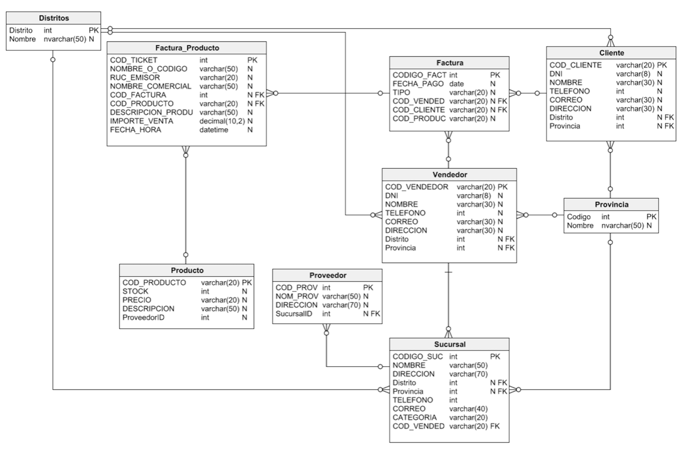

# SUNGLASS_HUT_BD

Este repositorio contiene la Base de Datos "SUNGLASS_HUT_BD" creada como parte del proyecto final del curso de Base de Datos de la Universidad Tecnológica del Perú.

## Descripción

La Base de Datos "SUNGLASS_HUT_BD" es una representación estructurada y organizada de la información relevante para el funcionamiento de una tienda de lentes de sol, inspirada en el conocido retailer "Sunglass Hut". La base de datos ha sido diseñada con el propósito de almacenar datos sobre productos, clientes, empleados y ventas, lo que permitirá llevar un control eficiente y adecuado de las operaciones del negocio.

## Estructura de la Base de Datos

La base de datos está compuesta por varias tablas, cada una con campos específicos para almacenar información relacionada. A continuación, se describen las principales tablas que conforman "SUNGLASS_HUT_BD":

1. **Tabla de Productos**: Esta tabla almacena detalles sobre los lentes de sol disponibles en la tienda, incluyendo el nombre del producto, la marca, el precio, el código de barras y la cantidad en inventario.

2. **Tabla de Clientes**: Aquí se encuentran los datos personales de los clientes, como nombre, dirección, número de teléfono y correo electrónico, lo que permitirá mantener un registro de los compradores y brindar un mejor servicio.

3. **Tabla de Empleados**: Esta tabla contiene información sobre los empleados que trabajan en la tienda de lentes de sol. Se incluyen datos como nombre completo, número de empleado, puesto, fecha de contratación y salario.

4. **Tabla de Ventas**: Aquí se registran todas las transacciones de venta realizadas en la tienda. Cada registro incluye la fecha de la venta, el cliente asociado, el empleado que realizó la venta y los productos adquiridos.

## Instalación y Uso

Para utilizar esta Base de Datos en un entorno local, sigue los siguientes pasos:

1. Clona este repositorio en tu máquina local utilizando el siguiente comando:

   ```
   https://github.com/Brandon-Meneses/SUNGLASS_HUT_BD.git
   ```

2. Importa el archivo de la Base de Datos a tu sistema de gestión de bases de datos (por ejemplo, MySQL o PostgreSQL) utilizando la herramienta adecuada.

3. Una vez importada, podrás comenzar a ejecutar consultas y realizar operaciones sobre la Base de Datos para acceder a la información almacenada.

## Diagrama de base de datos



## Contribuciones

Este proyecto ha sido creado como parte de un curso académico, por lo que actualmente no se aceptan contribuciones externas. Sin embargo, si deseas utilizar esta Base de Datos como base para un proyecto personal o académico, te animamos a que lo hagas y aportes mejoras a tu propia implementación.

## Agradecimientos

Agradecemos a la Universidad Tecnológica del Perú por brindar el curso de Base de Datos y proporcionar la oportunidad de desarrollar este proyecto final.

## Contacto

Si tienes preguntas, sugerencias o comentarios sobre este proyecto, no dudes en ponerte en contacto con el equipo detrás de "SUNGLASS_HUT_BD" enviando un correo electrónico a [blmenesess.19@gmail.com](mailto:tucorreo@example.com).

¡Gracias por visitar este repositorio y por tu interés en "SUNGLASS_HUT_BD"! Esperamos que esta Base de Datos sea de utilidad para tus propios proyectos relacionados con el manejo de información de una tienda de lentes de sol.
